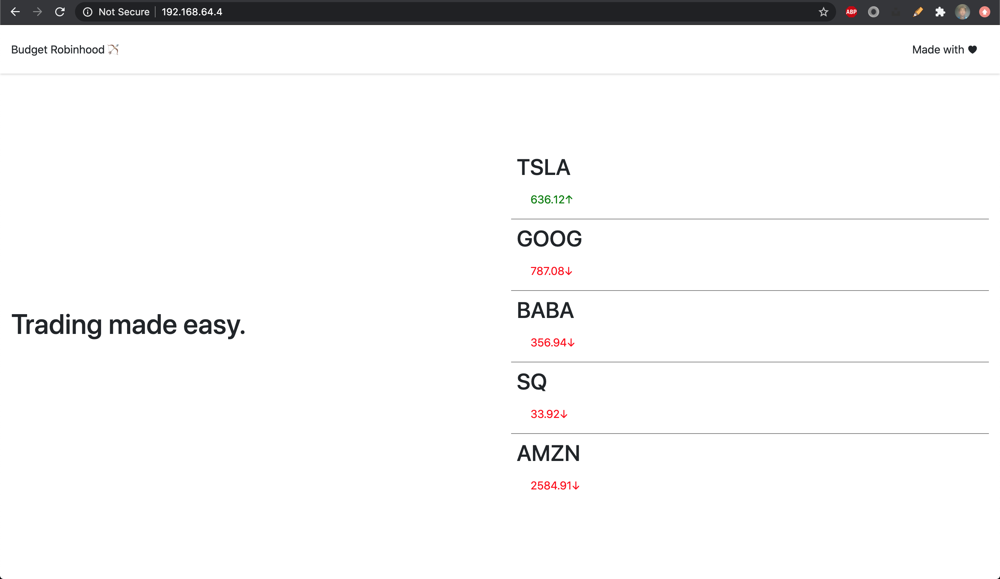

# Setup

## Prerequisites

* Minikube
* Kubernetes CLI (kubectl)
* Docker for individual service testing

## Steps

* boot up a Kubernetes instance with these steps:

  ``` bash
  minikube start --vm=true --driver=hyperkit
  minikube enable addons ingress
  minikube dashboard
  ```

* spin up pods and stuff

  ``` bash
  kubectl apply -f server/kubernetes/deployment.yml
  kubectl apply -f simDAQ/kubernetes/deployment.yml
  kubectl apply -f ingress.yml
  ```

* visit minikube dashboard, find ingress resource IP (eg. 192.168.64.4), navigate to said IP

* if all is well, you should see a nice diagram like this:


## Caveats

App is not "production ready" yet in that everything is still running in debug mode.
